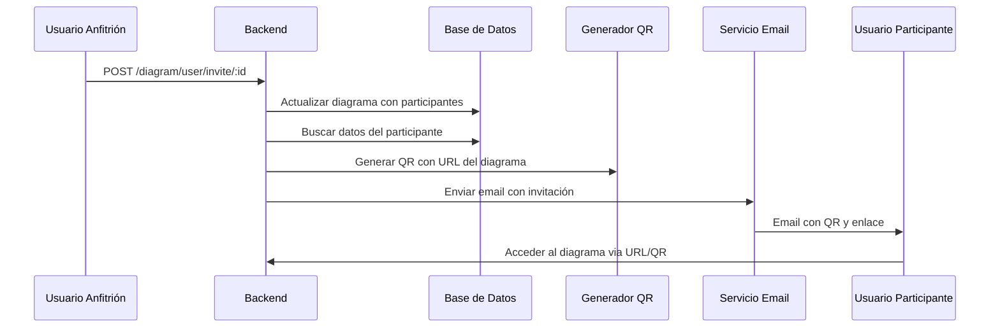

# Sistema de Correo e Invitaciones - Documentación Técnica

## 📧 Descripción General

Este sistema permite enviar invitaciones por correo electrónico para colaborar en proyectos de diagramas UML. Los usuarios pueden invitar a otros participantes a unirse a una "pizarra de trabajo" colaborativa, donde pueden editar diagramas en tiempo real.

## 🏗️ Arquitectura del Sistema

### Componentes Principales

1. **Backend (Node.js + TypeScript)**
   - Servidor Express.js
   - Base de datos MongoDB con Mongoose
   - Sistema de autenticación JWT
   - Servidor WebSocket (Socket.io) para colaboración en tiempo real

2. **Sistema de Correo**
   - Nodemailer para envío de emails
   - Mailtrap como servicio SMTP (entorno de desarrollo)
   - Plantillas HTML personalizadas

3. **Generación de QR**
   - Biblioteca QRCode para generar códigos QR
   - URLs directas a las salas de trabajo

## 🔄 Flujo de Invitaciones

### 1. Proceso de Invitación



### 2. Estructura de Datos

#### Modelo Diagram
```typescript
interface Diagram {
    _id?: string;
    name: string;                    // Nombre del proyecto
    plantUML?: string;              // Contenido del diagrama UML
    anfitrion: ObjectId;            // ID del usuario creador
    qr?: string;                    // Código QR generado
    participantes: ObjectId[];      // Array de IDs de participantes
    createdAt: string;
    updatedAt: string;
}
```

#### Modelo User
```typescript
interface User {
    _id?: string;
    firstName: string;
    lastName: string;
    email: string;                  // Email para envío de invitaciones
    password: string;
    createdAt: string;
    updatedAt: string;
}
```

## 📨 Configuración del Sistema de Correo

### Configuración Nodemailer

```typescript
// src/config/nodemailer.ts
const transport = createTransport({
    host: "sandbox.smtp.mailtrap.io",
    port: 2525,
    auth: {
        user: "95cf6977916e4a",
        pass: "ee9b22a0505702",
    },
});
```

**Nota**: Esta configuración utiliza Mailtrap para desarrollo. En producción, se debe configurar con un servicio SMTP real.

### Plantilla de Email

El sistema utiliza una plantilla HTML profesional que incluye:

- **Header**: Identificador del proyecto
- **Código QR**: Generado dinámicamente con la URL del diagrama
- **URL Directa**: Enlace para acceder al proyecto
- **Información del Proyecto**: Nombre y detalles de la pizarra de trabajo
- **Diseño Responsivo**: Compatible con dispositivos móviles

## 🔧 API Endpoints

### Invitación a Proyecto

```http
POST /diagram/user/invite/:id
Content-Type: application/json

{
    "participantes": ["userId1", "userId2"]
}
```

**Respuesta:**
```json
{
    "messageId": "email-message-id",
    "response": "Email sent successfully"
}
```

### Otros Endpoints Relacionados

```http
# Obtener diagramas de un usuario
GET /diagram/user/:id

# Crear nuevo diagrama
POST /diagram

# Actualizar diagrama
PUT /diagram/:id

# Agregar participante
POST /diagram/:id/participant
```

## 🎯 Funcionalidades del Sistema

### 1. Generación de Códigos QR

```typescript
// src/utils/qr.utils.ts
const generateQR = async (dataEvent: QR) => {
    const qrUrl = await QRCode.toDataURL(dataEvent.url);
    return qrUrl;
};
```

- Genera códigos QR con la URL del diagrama
- Tamaño estándar: 150x150 píxeles
- Formato: Data URL (base64)

### 2. Envío de Emails

```typescript
// src/services/diagram.service.ts
const createInvitacionDiagrama = async (id: string, diagram: Diagram) => {
    // 1. Actualizar diagrama con participantes
    await updateDiagramUML(id, diagram);
    
    // 2. Obtener datos del participante
    const userParticipante = await userModel.findById(userIdParticipante);
    
    // 3. Generar URL y QR
    const url = `http://137.184.205.247:5173/private/diagrams/${id}`;
    const qr = await generateQR({ url });
    
    // 4. Enviar email
    const mailOptions = await transport.sendMail({
        from: '"Marco David Toledo 🌀" <marcotoledo@midominio.com>',
        to: userParticipante!.email,
        subject: `Invitacion al la pizarra de trabajo: ${diagrama?.name}`,
        html: htmlTemplateEvent({
            _id: diagrama?._id,
            name: diagrama?.name,
            qr: qr,
        }, url),
        attachments: [{ 
            filename: `QR-${diagrama?.name}`, 
            path: `${qr}` 
        }],
    });
    
    return mailOptions;
};
```

### 3. Colaboración en Tiempo Real

El sistema utiliza Socket.io para permitir colaboración en tiempo real:

```typescript
// src/index.ts
io.on("connection", (socket: Socket) => {
    socket.on("joinRoom", ({ diagramId, user }) => {
        socket.join(diagramId);
        // Notificar a otros usuarios sobre la conexión
        io.to(diagramId).emit("usersConnectedUpdate", rooms[diagramId]);
    });

    socket.on("updateDiagram", ({ diagramId, diagramContent }) => {
        // Sincronizar cambios del diagrama
        io.to(diagramId).emit("diagramUpdated", diagramContent);
    });
});
```

## 🚀 Instalación y Configuración

### Dependencias Principales

```json
{
    "nodemailer": "^6.9.8",
    "qrcode": "^1.5.3",
    "socket.io": "^4.7.4",
    "mongoose": "^7.5.2",
    "express": "^4.18.2",
    "jsonwebtoken": "^9.0.2"
}
```

### Variables de Entorno Requeridas

```env
JWT_SECRET_KEY=your-secret-key
MONGODB_URI=mongodb://localhost:27017/your-database
SMTP_HOST=sandbox.smtp.mailtrap.io
SMTP_PORT=2525
SMTP_USER=your-smtp-user
SMTP_PASS=your-smtp-password
```

### Comandos de Ejecución

```bash
# Instalar dependencias
npm install

# Ejecutar en desarrollo
npm run dev

# Compilar TypeScript
npx tsc
```

## 🔒 Seguridad

### Autenticación
- JWT tokens con expiración de 24 horas
- Contraseñas hasheadas con bcrypt
- Validación de usuarios antes de enviar invitaciones

### Validaciones
- Verificación de existencia del usuario participante
- Validación de permisos del anfitrión
- Sanitización de datos de entrada

## 📱 Experiencia de Usuario

### Para el Anfitrión
1. Crear un nuevo diagrama/proyecto
2. Agregar participantes por ID de usuario
3. Enviar invitaciones automáticamente
4. Colaborar en tiempo real

### Para el Participante
1. Recibir email con invitación
2. Escanear QR o hacer clic en enlace
3. Acceder directamente al diagrama
4. Colaborar en tiempo real con otros usuarios

## 🐛 Solución de Problemas

### Problemas Comunes

1. **Email no enviado**
   - Verificar configuración SMTP
   - Comprobar credenciales de Mailtrap
   - Revisar logs del servidor

2. **QR no generado**
   - Verificar conexión a internet
   - Comprobar formato de URL
   - Revisar dependencia qrcode

3. **Usuario no encontrado**
   - Verificar que el ID del participante existe
   - Comprobar que el usuario está registrado
   - Validar estructura de datos

### Logs Importantes

```typescript
console.log(diagram);                    // Datos del diagrama
console.log(mailOptions);               // Confirmación de envío
console.log(`${user} joined room: ${diagramId}`); // Conexión WebSocket
```

## 🔮 Mejoras Futuras

1. **Plantillas de Email Personalizables**
2. **Notificaciones Push**
3. **Historial de Invitaciones**
4. **Roles y Permisos Granulares**
5. **Integración con Calendarios**
6. **Analytics de Uso**

## 📞 Soporte

Para soporte técnico o reportar problemas, contactar al equipo de desarrollo.

---

**Versión**: 1.0.0  
**Última actualización**: Enero 2025  

